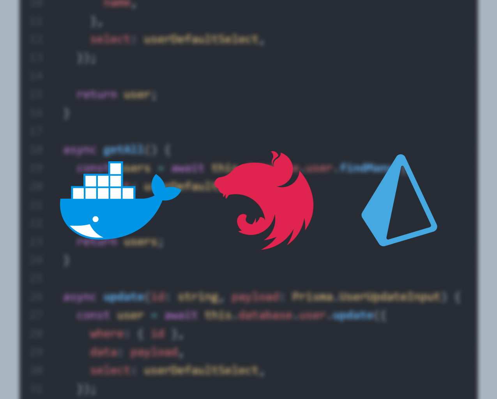
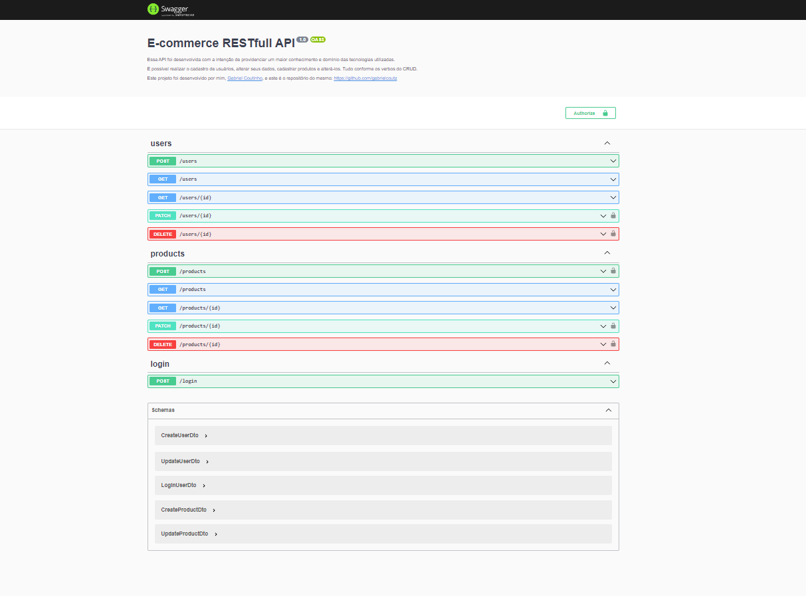

# RESTfull API para cadastro de usuários e produtos

  

## Tópicos

 • <a href="#sobre">📋 Sobre o Projeto</a>  
 • <a href="#tecnologias">🔮 Tecnologias</a>  
 • <a href="#funcionalidades">🛠 Funcionalidades</a>  
 • <a href="#executar">🚀 Como executar</a>  
 • <a href="#autor">😎 Autor</a>  

---

<h2 id="sobre">📋 Sobre o projeto</h2>

Este projeto tem como intenção providenciar um maior conhecimento e domínio das tecnologias utilizadas.

Além disso, para fins de estudos, também é utilizado consumindo um banco de dados MySQL hospedado em um container Docker.

Posteriormente será colocada em uma imagem Docker e disponibilizada publicamente pare testes, estudos e afins.

---

<h2 id="tecnologias">🔮 Tecnologias</h2>

     

---

<h2 id="funcionalidades">🛠 Funcionalidades</h2>

**Cadastro de usuários**

:white_check_mark: CRUD

:white_check_mark: Autenticação JWT para alterar/deletar dados

**Cadastro de produtos**

:white_check_mark: CRUD

:white_check_mark: Autenticação JWT para alterar/deletar dados

**Documentação**

:white_check_mark: Disponibilizada por meio do  no endpoint `/docs`

  

---

<h2 id="executar">🚀 Como executar</h2>

- 1° Clone o projeto com `git clone https://github.com/GabrielCoutz/nestjs-prisma-api.git .`
 
- 2° Crie um arquivo `.env` com a sua configuração do prisma para conexão com o banco, se baseando no arquivo `.env.example`
Mais info sobre conexão com o banco: https://www.prisma.io/docs/getting-started/setup-prisma/start-from-scratch/relational-databases/connect-your-database-typescript-mysql
 
- 3° Instale as dependências com `npm install`
 
- 4° Rode o projeto com `npm run start:dev`
 
- 5° Confira a documentação no endpoint `/docs`
---

<h2 id="author">😎 Entre em contato</h2>

 

  Desenvolvido por <strong>eu mesmo😊</strong>

